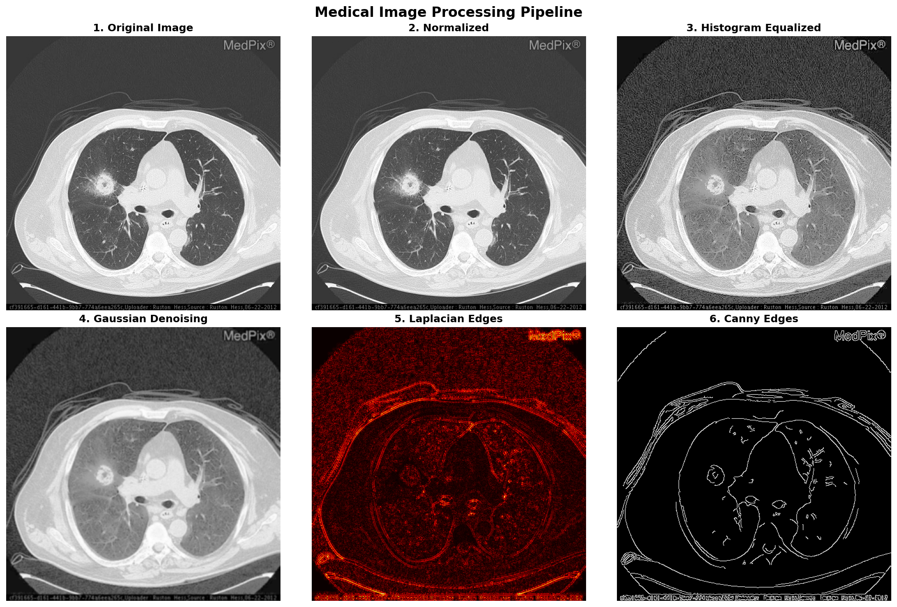

# Medical Image Processing Pipeline

A Python-based tool for medical image enhancement and edge detection, supporting DICOM, JPEG, and PNG formats.

## Results



*Complete processing pipeline showing normalization, denoising, and edge detection*

## Features

- **Multi-format Support**: DICOM (.dcm), JPEG, PNG
- **Image Enhancement**: Intensity normalization, histogram equalization, Gaussian denoising
- **Edge Detection**: Laplacian filtering, Canny edge detection
- **Visualization**: Comprehensive before/after comparison

## Tech Stack

Python • OpenCV • NumPy • Matplotlib • pydicom

## Usage
```bash
pip install opencv-python numpy matplotlib pydicom

python medical_image_pipeline.py your_image.jpg
